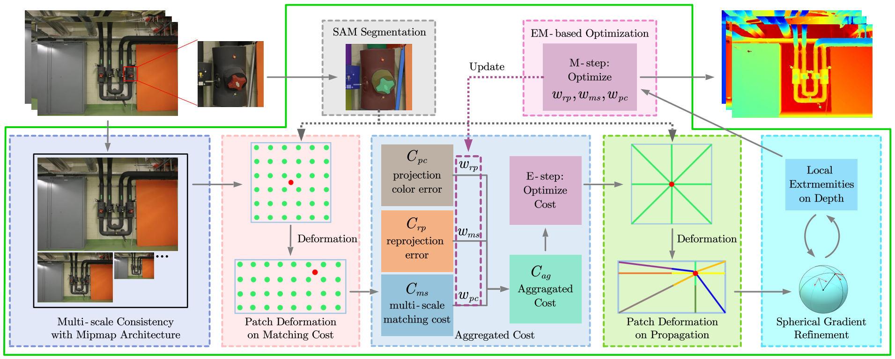

# SD-MVS

Zhenlong Yuan, Jiakai Cao, Zhaoxin Li, Hao Jiang, and Zhaoqi Wang, [**SD-MVS: Segmentation-Driven Deformation Multi-View Stereo with Spherical Refinement and EM optimization**](https://arxiv.org/pdf/2401.06385), AAAI 2024.


## Introduction
SD-MVS is the first method who combines the instance segmentation model **SAM** with multi-view stereo(**MVS**) algorithm to address limited receptive field of PatchMatch-based MVS.

Our paper was accepted by **AAAI2024**!

If you find this project useful for your research, please cite:  

```
@InProceedings{SD-MVS,
  title = {{{SD-MVS}}: {{Segmentation-Driven Deformation Multi-View Stereo}} with {{Spherical Refinement}} and {{EM Optimization}}},
  shorttitle = {{{SD-MVS}}},
  booktitle = {Proceedings of the {{AAAI Conference}} on {{Artificial Intelligence}}},
  author = {Yuan, Zhenlong and Cao, Jiakai and Li, Zhaoxin and Jiang, Hao and Wang, Zhaoqi},
  year = {2024},
  volume = {38},
  pages = {6871--6880}
}
```
## Code
Code is coming soon.

## Acknowledgements

This code largely benefits from the following repositories: [ACMMP](https://github.com/GhiXu/ACMMP.git), [SAM](https://github.com/facebookresearch/segment-anything) and [Gipuma](https://github.com/kysucix/gipuma). Thanks to their authors for opening the source of their excellent works.
https://github.com/facebookresearch/segment-anything
